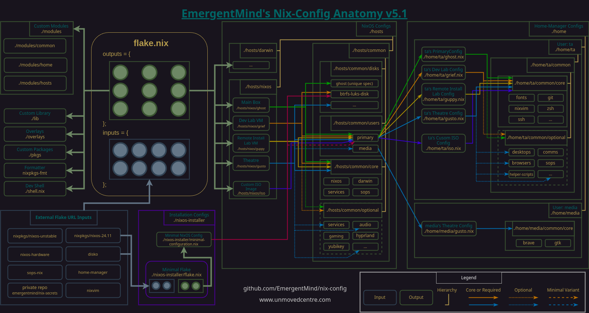

# Anatomy

[README](../README.md) > Anatomy

## Structural Concept

The following diagram depicts the conceptual anatomy of my nix-config. It is not an accurate representation of the current state but _will_ be updated over time to represent additional elements and details as the config evolves.

## Fleet mapping (diagrams → real machines → introdus glue)

Compare `diagrams/anatomy_v5.png` / `anatomy_v5.1.png` and the editable `diagrams/nix-config.drawio` against the fleet we want to drive from one workstation:

| Target machine | Closest diagram role | Gap today | Introdus glue |
| --- | --- | --- | --- |
| alice (workstation) | ghost / primary box | naming + “control seat” for rebuilds | `rebuild-host`, `bootstrap-nixos`, shared modules/lib/checks ([issues](https://codeberg.org/fidgetingbits/introdus/issues), esp. #30) |
| rpi4-0x\* | _(missing)_ | no aarch64 in `systems` / no host entries | same `introdus.nixosModules` + overlay once arch is enabled |
| nuc | gusto-class mini / optional server | hostSpec role, not a copy of gusto | `introdus.*` options + thin `hosts/nixos/nuc` |
| macbook | darwin lane in diagrams | `darwinConfigurations` commented out | HM module set + future darwin introdus path |

Code comments calling out these glue points live in `flake.nix`, `shell.nix`, `hosts/common/core/`, `home/common/core/`, `modules/common/host-spec.nix`, and `checks/default.nix`.

## Details

For details about the design concepts, constraints, and how structural elements interact, see the article and/or Youtube video [Anatomy of a NixOS Config](https://unmovedcentre.com/posts/anatomy-of-a-nixos-config/) available on my website.

## Previous Iterations of the Structural Concept

---

[Return to top](#anatomy)

[README](../README.md) > Anatomy
